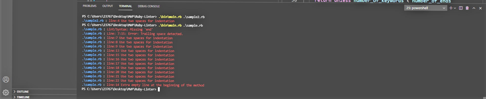
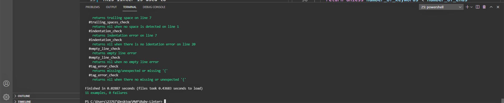

# Ruby Linter

# About 
This project provides feedback about errors or warnings in ruby codes. 

This linter is used to 
- check for trailing spaces
- check for missing/unexpected tags i.e. '( )', '[ ]', and '{ }'
- check for wrong indentation
- check missing/unexpected end
- check empty line error

## Technologies
- VSCode (editor)
- Ruby (language)
- Git/GitHub (version control)
- Rspec(domain-specific language (DSL)

## Getting Started

### Prerequisites

- [Install Ruby](https://www.ruby-lang.org/en/downloads/) on your system.

### Setup & Run

 - $ git clone git@github.com:Fondem-Jr/Ruby-Linter.git
 - $ cd ./Ruby-Linter
 - $ ruby `.\bin\main.rb sample.rb` where sample.rb is the file i want to check for errors.
 - To test another file, enter `.\bin\main.rb (filename)` where filename is replaced by the name of the file without including the parenthesis

## Running tests with Rspec

This project is tested with Rspec(domain-specific language (DSL)) testing tool written in Ruby programming language to test Ruby code. It is a behavior-driven development (BDD) framework which is extensively used in production applications.

## How to get Rspec running

- Open the terminal, type `gem install rspec`
- Once rspec installed, you can check for the version using `rspec --version`
- Go to project directory and type `rspec --init` to initialize the rspec in your project
- You will see a folder `spec` and a file `.rspec`
- Inside spec folder you'll see a `spec_helper.rb` file.
- Create your spec files in the spec folder.
- In the terminal, type `rspec` to run the spec file

## Note

> To install the gem file, run

~~~bash
$ bundle install 
~~~

> But before that, make sure you have **bundler** installed on your system, else run

~~~bash
$ gem install bundler 
~~~

> or you simply install the the following directly using 

~~~bash
$ gem install rspec 
~~~

~~~bash
$ gem install colorize 
~~~

~~~ I needed to exclude `sample.rb` and `sample2.rb` from the Rubocop test

## Rspec output

## Authors
👤 **Fondem Junior**
 - [Github](https://github.com/Fondem-Jr)
 - [Linkedin](https://www.linkedin.com/in/fondem-junior-57484744/)
 - [Twitter](https://twitter.com/OpportunistZeus)

## 🤝 Contributing

Contributions, issues and feature requests are welcome!

## Show your support

Give a ⭐️ if you like this project!

## Acknowledgments

- Project inspired by [Microverse](https://www.microverse.org)